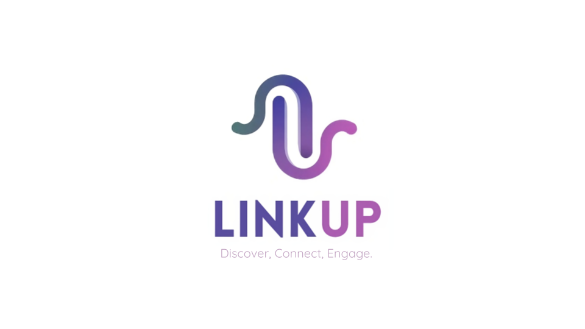

# Link Up

Link Up was created by **Mahmoud Hammam** and **Youssef El Ghamour** as a project for the **ALX Software Engineering program** (Holberton School). The goal was to develop a platform that replicates the core functionalities of a social media platform. The project was created by **Mahmoud Hammam** and **Youssef El Ghamour**.

## Introduction

Link Up is a social media platform designed to connect users through familiar functionalities similar to those found on major big social media platforms. It enables users to create profiles, establish friend connections, share content, and keep up with a personalized news feed. The platform aims to foster online community building and interaction.

Link Up offers a variety of features tailored to user engagement, including:

- **User Profiles:** Users can create and customize their profiles, including uploading profile pictures and sharing personal information.
- **Friend Connections:** Users can follow others to keep up with their updates and activities.
- **Chat Functionality:** Engage in real-time conversations with friends through the chat feature.
- **Content Sharing:** Users can post status updates, photos, and other content to share with their friends.
- **News Feed:** A dynamic feed that displays posts and activities from friends and connections.
- **User Authentication:** Secure login system ensuring users' data and activities are protected.
- **Search Functionality:** Find users and content easily with the search bar.

## Technologies Used

Link Up is built using the following technologies:

- **Python:** Main programming language for backend development.
- **Flask:** Lightweight web framework for building web applications in Python.
- **MySQL:** Relational database management system for data storage.
- **SQLAlchemy:** Python SQL toolkit and ORM for interacting with MySQL databases.
- **HTML/CSS:** Frontend development and styling.
- **Jinja:** Templating engine for generating dynamic HTML content.
- **JavaScript:** Programming language for adding interactivity to web pages.
- **jQuery:** JavaScript library for simplifying client-side scripting.
- **Git:** Version control system for tracking changes in the codebase.
- **GitHub:** Platform for hosting and collaboration on the project.

## Setup

To set up Link Up locally, follow these steps:

1. Clone the repository: `git clone https://github.com/MahmoudHammam0/LinkUp.git`
2. Navigate to the project directory: `cd LinkUp`
3. Install dependencies: `pip install -r requirements.txt`
4. Set up MySQL database: `cat setup_mysql_dev.sql | mysql -hlocalhost -uroot -p`
5. Run the Flask application: `python -m web_flask.app`
6. Run the API in a seperate terminal: `python -m api.v1.app`
7. Access the application in your web browser at `http://localhost:5000`

## Usage

Once Link Up is set up, you can use the following steps to interact with the platform:

1. Sign up to create a user account.
2. Create and customize your user profile.
3. Follow other users to build your network.
4. Share updates, photos, and other content on your news feed.
5. View and interact with the posts of your friends.
6. Find users and content easily with the search bar.

## Next Steps

While Link Up currently offers features like chat and search, potential future enhancements could include advanced notification systems and additional functionalities to further engage and connect users.

## Demo Video

https://github.com/user-attachments/assets/3d0a629e-ba86-4991-8912-03930ad2b5eb

## Authors

- Mahmoud Hammam - [GitHub](https://github.com/MahmoudHammam0)
- Youssef El Ghamour - [GitHub](https://github.com/youssefelghamour)
